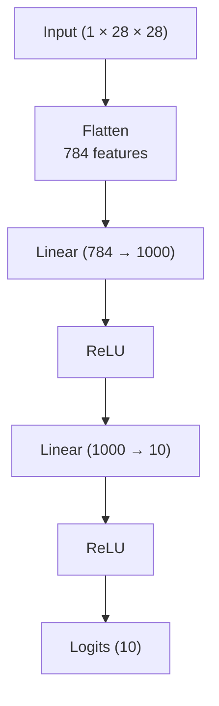
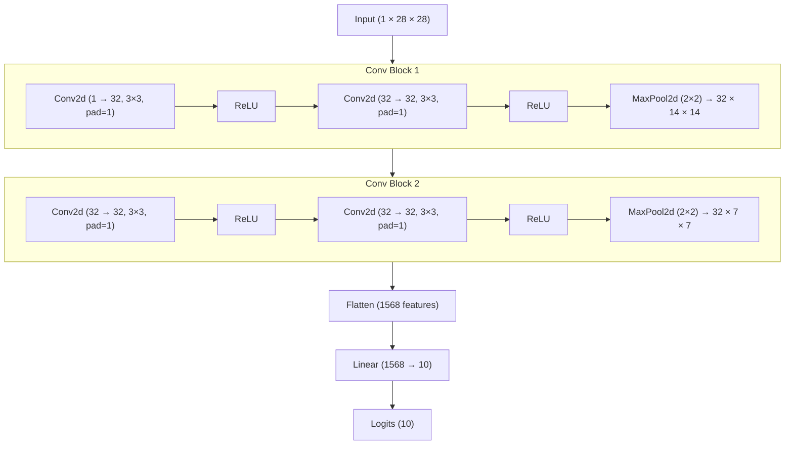

# PyTorch Computer Vision: FashionMNIST Classifier

A computer vision project built with PyTorch that trains and compares two neural network architectures — a fully connected classifier and a convolutional neural network (CNN) — on the FashionMNIST dataset. The project covers the full ML workflow: data loading, preprocessing, model definition, training, evaluation, and prediction visualization.

---

## Table of Contents

- [Overview](#overview)
- [Dataset](#dataset)
- [Models](#models)
  - [Model 1: Fully Connected Classifier](#model-1-fully-connected-classifier)
  - [Model 2: CNN (TinyVGG-inspired)](#model-2-cnn-tinyvgg-inspired)
- [Project Structure](#project-structure)
- [Getting Started](#getting-started)
  - [Prerequisites](#prerequisites)
  - [Installation](#installation)
  - [Running the Notebook](#running-the-notebook)
- [Training Details](#training-details)
- [Results](#results)
- [Key Concepts Covered](#key-concepts-covered)
- [Acknowledgements](#acknowledgements)

---

## Overview

This notebook explores image classification using PyTorch on the FashionMNIST dataset. Two architectures are built from scratch and compared:

1. A **multi-layer perceptron (MLP)** with a single hidden layer of 1000 neurons, trained for 25 epochs using SGD.
2. A **convolutional neural network (CNN)** based on the TinyVGG architecture, trained for 3 epochs using Adam.

The CNN achieves comparable or better accuracy in far fewer epochs, demonstrating the advantage of convolutional architectures for image tasks.

---

## Dataset

**FashionMNIST** is a dataset of 28×28 grayscale images of clothing items across 10 categories:

| Label | Class        |
|-------|--------------|
| 0     | T-shirt/top  |
| 1     | Trouser      |
| 2     | Pullover     |
| 3     | Dress        |
| 4     | Coat         |
| 5     | Sandal       |
| 6     | Shirt        |
| 7     | Sneaker      |
| 8     | Bag          |
| 9     | Ankle boot   |

- **Training samples:** 60,000
- **Test samples:** 10,000
- **Image shape:** `(1, 28, 28)` — single-channel grayscale

**Preprocessing:** All images are converted to tensors and normalized with mean `0.5` and std `0.5`, mapping pixel values to the range `[-1, 1]`.

---

## Models

### Model 1: Fully Connected Classifier



- **Architecture:** `nn.Sequential` with a `Flatten` layer, two linear layers, and ReLU activations
- **Hidden units:** 1000
- **Output:** 10 class logits
- **Optimizer:** SGD (lr=0.1)
- **Loss:** CrossEntropyLoss
- **Epochs:** 25
- **Batch size:** 32

### Model 2: CNN (TinyVGG-inspired)



- **Architecture:** Two convolutional blocks with MaxPooling, followed by a linear classifier head
- **Hidden units:** 32 channels per conv layer
- **Output:** 10 class logits
- **Optimizer:** Adam (lr=1e-3)
- **Loss:** CrossEntropyLoss
- **Epochs:** 3
- **Batch size:** 32

---

## Project Structure

```
.
├── Pytorch_computer_vision_video.ipynb   # Main notebook
├── helper_functions.py                   # Auto-downloaded utility functions (mrdbourke/pytorch-deep-learning)
├── data/                                 # FashionMNIST dataset (auto-downloaded by torchvision)
├── FashionMNIST                          # Saved MLP model (torch.save)
└── FashionMNISTCNN                       # Saved CNN model (torch.save)
```

---

## Getting Started

### Prerequisites

- Python 3.8+
- PyTorch 1.12+
- torchvision
- matplotlib
- numpy
- tqdm

### Installation

```bash
pip install torch torchvision matplotlib numpy tqdm
```

Or if using Google Colab, these are pre-installed. The notebook also auto-downloads a `helper_functions.py` file from [mrdbourke/pytorch-deep-learning](https://github.com/mrdbourke/pytorch-deep-learning) if it's not already present.

### Running the Notebook

**Locally:**
```bash
jupyter notebook Pytorch_computer_vision_video.ipynb
```

**On Google Colab:**
Upload the notebook and run all cells. The dataset will be downloaded automatically via `torchvision.datasets.FashionMNIST`.

**GPU acceleration:** The notebook auto-detects CUDA:
```python
device = 'cuda' if torch.cuda.is_available() else 'cpu'
```

> **Note:** If a saved model file (`FashionMNIST`) is detected in the working directory, the notebook skips training and loads the model directly. This is useful for inference without re-training.

---

## Training Details

| Setting         | MLP (Model 1)     | CNN (Model 2)     |
|----------------|-------------------|-------------------|
| Optimizer       | SGD               | Adam              |
| Learning Rate   | 0.1               | 1e-3              |
| Epochs          | 25                | 3                 |
| Batch Size      | 32                | 32                |
| Loss Function   | CrossEntropyLoss  | CrossEntropyLoss  |

Training loss and accuracy are tracked per epoch and plotted at the end of training for each model. Evaluation is run batch-by-batch on the test set using `torch.inference_mode()`.

A custom `accuracy_fn` is used throughout:
```python
def accuracy_fn(Y_pred, Y_true):
    count = torch.eq(Y_pred, Y_true).sum().item()
    return count / len(Y_pred) * 100
```

---

## Results

After training, both models are evaluated on the full test set. Overall test accuracy and loss are reported as averages across all test batches.

The CNN achieves strong performance in just **3 epochs** with Adam, typically outperforming or matching the MLP trained for **25 epochs** with SGD — demonstrating the efficiency of convolutional architectures for structured image data.

Predictions are visualized on a random sample of 9 test images:
- **Green title** → correct prediction
- **Red title** → incorrect prediction (shows both predicted and true label)

---

## Key Concepts Covered

- Loading and exploring a standard image classification dataset with `torchvision.datasets`
- Data normalization and the `transforms.Compose` pipeline
- Building custom `nn.Module` classes (MLP and CNN)
- The TinyVGG convolutional architecture pattern (two conv blocks + classifier head)
- SGD vs Adam optimizers
- `CrossEntropyLoss` for multi-class classification
- Softmax + argmax for converting logits to predicted class indices
- Training and evaluation loops with `model.train()` / `model.eval()`
- Saving and loading models with `torch.save` / `torch.load`
- Visualizing training curves (loss and accuracy over epochs)
- Making and visualizing predictions on held-out test samples

---

## Acknowledgements

- Dataset: [FashionMNIST](https://github.com/zalandoresearch/fashion-mnist) by Zalando Research
- Helper functions from [mrdbourke/pytorch-deep-learning](https://github.com/mrdbourke/pytorch-deep-learning)
- CNN architecture inspired by [TinyVGG](https://poloclub.github.io/cnn-explainer/)
