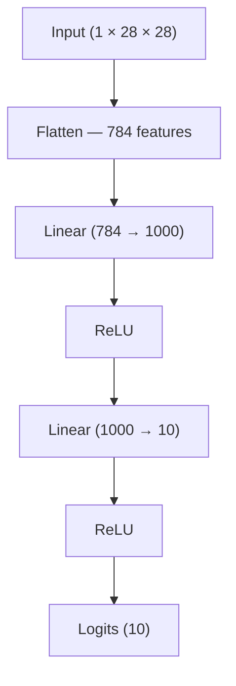
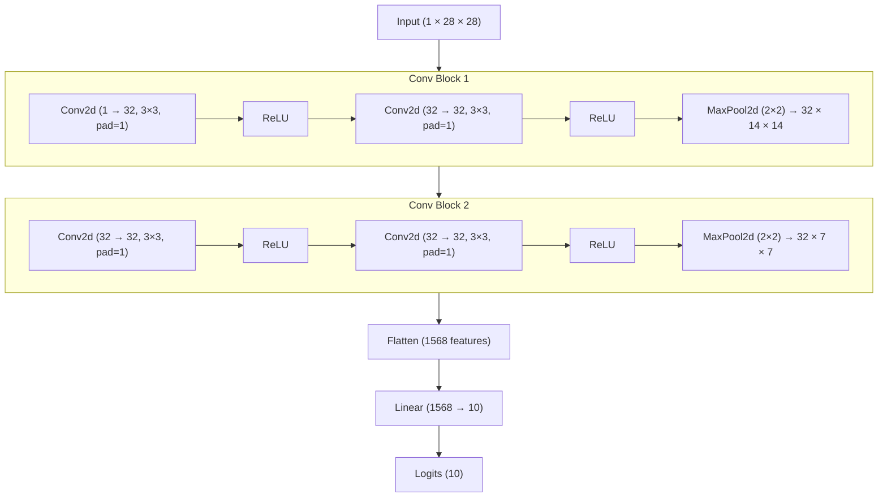

# FashionMNIST — MLP vs CNN

One of those projects where the whole point was to *feel* the difference between a plain neural network and a CNN, not just read about it. Built both from scratch in PyTorch, trained them on FashionMNIST, and compared what happened.

---

## Table of Contents

- [What's this about](#whats-this-about)
- [Dataset](#dataset)
- [Models](#models)
  - [Model 1: MLP](#model-1-mlp)
  - [Model 2: CNN (TinyVGG-inspired)](#model-2-cnn-tinyvgg-inspired)
- [Project Structure](#project-structure)
- [Getting Started](#getting-started)
- [Training Details](#training-details)
- [Results](#results)
- [What I learned](#what-i-learned)
- [Acknowledgements](#acknowledgements)

---

## What's this about

I wanted to understand why everyone keeps saying CNNs are better for images. So instead of just taking it on faith, I built an MLP first — flattening images and throwing them at linear layers — then built a CNN and trained both on the same dataset.

The MLP needed 25 epochs with SGD to get decent results. The CNN got there in 3 epochs with Adam. That gap is the whole lesson.

---

## Dataset

FashionMNIST — 70,000 grayscale images of clothing, 28×28 pixels each, 10 classes. It's basically the go-to dataset when MNIST feels too easy but you don't want to deal with full-blown image datasets yet.

| Label | Class        |
|-------|--------------|
| 0     | T-shirt/top  |
| 1     | Trouser      |
| 2     | Pullover     |
| 3     | Dress        |
| 4     | Coat         |
| 5     | Sandal       |
| 6     | Shirt        |
| 7     | Sneaker      |
| 8     | Bag          |
| 9     | Ankle boot   |

- **Train:** 60,000 images
- **Test:** 10,000 images
- **Shape:** `(1, 28, 28)` — single channel, grayscale

Images are normalized to `[-1, 1]` using mean and std of `0.5`.

---

## Models

### Model 1: MLP

The naive approach — flatten the image into 784 numbers and hope the network figures it out.



- **Optimizer:** SGD (lr=0.1)
- **Epochs:** 25
- **Batch size:** 32

### Model 2: CNN (TinyVGG-inspired)

Two convolutional blocks that actually look at the image spatially before making predictions. Based loosely on the TinyVGG architecture.



- **Optimizer:** Adam (lr=1e-3)
- **Epochs:** 3
- **Batch size:** 32

---

## Project Structure

```
.
├── CNN_Fashion_MNIST.ipynb     # The whole thing lives here
├── data/                       # FashionMNIST downloads here automatically
├── FashionMNIST                # Saved MLP model
└── FashionMNISTCNN             # Saved CNN model
```

---

## Getting Started

### Install dependencies

```bash
pip install torch torchvision matplotlib numpy tqdm
```

Or just run it on Google Colab — everything's pre-installed there.

### Run the notebook

```bash
jupyter notebook CNN_Fashion_MNIST.ipynb
```

CUDA is detected automatically — if you have a GPU it'll use it, otherwise CPU is fine for this scale.

> If a saved model file is found in the directory, the notebook skips training and loads it directly. Handy for just running inference without waiting.

---

## Training Details

| Setting         | MLP               | CNN               |
|----------------|-------------------|-------------------|
| Optimizer       | SGD               | Adam              |
| Learning Rate   | 0.1               | 1e-3              |
| Epochs          | 25                | 3                 |
| Batch Size      | 32                | 32                |
| Loss Function   | CrossEntropyLoss  | CrossEntropyLoss  |

Loss and accuracy are tracked per epoch and plotted. Evaluation uses `torch.inference_mode()` across the full test set.

Custom accuracy function used throughout:
```python
def accuracy_fn(Y_pred, Y_true):
    count = torch.eq(Y_pred, Y_true).sum().item()
    return count / len(Y_pred) * 100
```

---

## Results

Both models are evaluated on the full test set after training. The CNN comfortably matches or beats the MLP despite training for a fraction of the time — which honestly was satisfying to see play out in practice.

Predictions on 9 random test images are visualized at the end:
- **Green** → got it right
- **Red** → got it wrong (shows predicted vs actual label)

---

## What I learned

- Flattening an image throws away all spatial information — the MLP has no idea that nearby pixels are related
- CNNs learn features hierarchically (edges → shapes → patterns), which is why they're so much better suited for images
- Adam converges noticeably faster than SGD here — 3 epochs vs 25 is a difference you actually feel
- `model.train()` and `model.eval()` don't matter much for simple architectures like these, but they will once you add BatchNorm or Dropout

---

## Acknowledgements

- Dataset: [FashionMNIST](https://github.com/zalandoresearch/fashion-mnist) by Zalando Research
- CNN architecture inspired by [TinyVGG](https://poloclub.github.io/cnn-explainer/)
